# SFND 3D Object Tracking

**FP.0 Final Report**

*Provide a Writeup / README that includes all the rubric points and how you addressed each one. You can submit your writeup as markdown or pdf.*

**FP.1 Match 3D Objects**

*Implement the method "matchBoundingBoxes", which takes as input both the previous and the current data frames and provides as output the ids of the matched regions of interest (i.e. the boxID property). Matches must be the ones with the highest number of keypoint correspondences.*

Constructed an outer loop over the matched keypoints, then found which keypoints were contained in the previous and current frame, then stored these in a multimap. The matched keypoints were then counted to find the highest frequency (mode), then stored the current and previous bounding box in a multimap.

```cpp
void matchBoundingBoxes(std::vector<cv::DMatch> &matches, std::map<int, int> &bbBestMatches, DataFrame &prevFrame, DataFrame &currFrame)
{
    // basic Idea = use keypoint matches between the previous and current image
    std::multimap<int, int> potential_matches;
    typedef std::multimap<int, int>::iterator MMAPIterator;

    //outer loop over keypoint matches

    for (const auto &it : matches)
    {
        int id_prev = -1;
        int id_curr = -1;

        //try to find out by which bounding boxes keypoints are enclosed both on the previous and current frame (Potential match cantidates)

        // https://docs.opencv.org/3.4/d2/d44/classcv_1_1Rect__.html#details
        //  OpenCV typically assumes that the top and left boundary of the rectangle are inclusive, while the right and bottom boundaries are not. For example, the method Rect_::contains returns true if
        //  x≤pt.x<x+width,y≤pt.y<y+height
        cv::KeyPoint kp_prev = prevFrame.keypoints[it.queryIdx];
        for (auto &bb_prev : prevFrame.boundingBoxes)
        {

            if (bb_prev.roi.contains(kp_prev.pt))
            {
                id_prev = bb_prev.boxID;
            }
        }

        cv::KeyPoint kp_curr = currFrame.keypoints[it.trainIdx];
        for (auto &bb_curr : currFrame.boundingBoxes)
        {
            if (bb_curr.roi.contains(kp_curr.pt))
            {
                id_curr = bb_curr.boxID;
            }
        }

        //store potential matches in a multimap
        if (id_prev != -1)
        {
            potential_matches.insert(std::make_pair(id_curr, id_prev));
        }
    }

    vector<int> box_ids;

    for (auto &bb : currFrame.boundingBoxes)
    {
        box_ids.push_back(bb.boxID);
    }
    std::cout << endl;

    //find all matches in the multimap which share the same bounding box ID in the previous frame and count them

    for (const auto &it_boxid : box_ids)
    {
        multimap<int, int> map_matches;

        auto prev_ids = potential_matches.equal_range(it_boxid);

        //http://www.cplusplus.com/reference/map/multimap/equal_range/
        std::pair<std::multimap<int, int>::iterator, std::multimap<int, int>::iterator> ret;
        ret = potential_matches.equal_range(it_boxid);
        vector<int> prev_box_id, count_previd;

        for (std::multimap<int, int>::iterator it = ret.first; it != ret.second; ++it)
        {
            prev_box_id.push_back(it->second);
        }

        std::map<int, int> frequency;
        for (int i : prev_box_id)
            ++frequency[i];

        //associate the bounding boxes with the highest number of occurances
        using pair_type = decltype(frequency)::value_type;
        auto pr = std::max_element(
            std::begin(frequency), std::end(frequency),
            [](const pair_type &p1, const pair_type &p2) {
                return p1.second < p2.second;
            });

        //return box ids of all matched pairs im map bbBestMatches
        bbBestMatches.insert(std::pair<int, int>(pr->first, it_boxid));
    }
}
```


**FP.2 Compute Lidar-based TTC**

*Compute the time-to-collision in second for all matched 3D objects using only Lidar measurements from the matched bounding boxes between current and previous frame.*

The median lidar points in the bounding box were selected to avoid any miscalculation due to outliers. The constant velocity model was used to calculate the approximate time to collision, this assumes that the rate of change of distance is linear. 

```cpp
void computeTTCLidar(std::vector<LidarPoint> &lidarPointsPrev, std::vector<LidarPoint> &lidarPointsCurr, double frameRate, double &TTC)
{
    // auxiliary variables
    double dT = 0.1;        // time between two measurements in seconds
    double laneWidth = 4.0; // assumed width of the ego lane
   
    std::sort(lidarPointsPrev.begin(), lidarPointsPrev.end(), sortfunction);
    std::sort(lidarPointsCurr.begin(), lidarPointsCurr.end(), sortfunction);

    double median_prev = lidarPointsPrev[lidarPointsPrev.size() / 2].x;
    double median_curr = lidarPointsCurr[lidarPointsCurr.size() / 2].x;

    // compute TTC from both measurements
    TTC = median_curr * dT / (median_prev - median_curr);
}
```


**FP.3 Associate Keypoint Correspondences with Bounding Boxes**

*Prepare the TTC computation based on camera measurements by associating keypoint correspondences to the bounding boxes which enclose them. All matches which satisfy this condition must be added to a vector in the respective bounding box.*

The total distance between all matched keypoints for the bounding box were calculated and divided by the total number of keypoints for that bounding box to get the mean distance. If the euclidian distance was lower than the mean distance the keypoint was added to the vector of  keypoint matches and keypoints for the bounding box.

```cpp
// associate a given bounding box with the keypoints it contains
void clusterKptMatchesWithROI(BoundingBox &boundingBox, std::vector<cv::KeyPoint> &kptsPrev, std::vector<cv::KeyPoint> &kptsCurr, std::vector<cv::DMatch> &kptMatches)
{
    bool verbose = false;
    // compute a robust mean of all the euclidean distances between keypoint matches
    // and then remove those that are too far away from the mean.

    int num_points = 0;
    float tot_dist = 0.0;

    for (cv::DMatch match : kptMatches)
    {
        cv::KeyPoint keypoint = kptsCurr[match.trainIdx];

        //checking whether the corresponding keypoints are within the region of interest in the camera image
        if (boundingBox.roi.contains(keypoint.pt))
        {

            cv::KeyPoint prev_keypoint = kptsPrev[match.queryIdx];

            tot_dist += cv::norm(keypoint.pt - prev_keypoint.pt);
            num_points += 1;
        }
    }

    float mean_dist = tot_dist / (float)num_points;

    for (cv::DMatch match : kptMatches)
    {
        cv::KeyPoint keypoint = kptsCurr[match.trainIdx];
        cv::KeyPoint prev_keypoint = kptsPrev[match.queryIdx];

        float dist = cv::norm(keypoint.pt - prev_keypoint.pt);

        //checking whether the corresponding keypoints are within the region of interest in the camera image
        if (boundingBox.roi.contains(kptsCurr[match.trainIdx].pt) && dist <= mean_dist)
        {
            //All matches which satisfy this condition should be added to a vector
            boundingBox.kptMatches.push_back(match);
            boundingBox.keypoints.push_back(keypoint);
        }
    }

}
```


**FP.4 Compute Camera-based TTC**

*Compute the time-to-collision in second for all matched 3D objects using only keypoint correspondences from the matched bounding boxes between current and previous frame.*

The mean of euclidean distances between the current frame and previous frame matched keypoints were calculated. The median distance was then calculated to remove the outliers.

```cpp
// Compute time-to-collision (TTC) based on keypoint correspondences in successive images
void computeTTCCamera(std::vector<cv::KeyPoint> &kptsPrev, std::vector<cv::KeyPoint> &kptsCurr,
                      std::vector<cv::DMatch> kptMatches, double frameRate, double &TTC, cv::Mat *visImg)
{

    // compute the lowest mean of all euclidean distances between keypoint matches and
    // remove those that are too far away from the mean

    // compute distance ratios between all matched keypoints
    vector<double> distRatios; // stores the distance ratios for all keypoints between curr. and prev. frame
    for (auto it1 = kptMatches.begin(); it1 != kptMatches.end() - 1; ++it1)
    { // outer kpt. loop

        // get current keypoint and its matched partner in the prev. frame
        cv::KeyPoint kpOuterCurr = kptsCurr.at(it1->trainIdx);
        cv::KeyPoint kpOuterPrev = kptsPrev.at(it1->queryIdx);

        for (auto it2 = kptMatches.begin() + 1; it2 != kptMatches.end(); ++it2)
        { // inner kpt.-loop

            double minDist = 100.0; // min. required distance

            // get next keypoint and its matched partner in the prev. frame
            cv::KeyPoint kpInnerCurr = kptsCurr.at(it2->trainIdx);
            cv::KeyPoint kpInnerPrev = kptsPrev.at(it2->queryIdx);

            // compute distances and distance ratios
            double distCurr = cv::norm(kpOuterCurr.pt - kpInnerCurr.pt);
            double distPrev = cv::norm(kpOuterPrev.pt - kpInnerPrev.pt);

            if (distPrev > std::numeric_limits<double>::epsilon() && distCurr >= minDist)
            { // avoid division by zero

                double distRatio = distCurr / distPrev;
                distRatios.push_back(distRatio);
            }
        } // eof inner loop over all matched kpts
    }     // eof outer loop over all matched kpts

    // only continue if list of distance ratios is not empty
    if (distRatios.size() == 0)
    {
        TTC = NAN;
        return;
    }

    std::sort(distRatios.begin(), distRatios.end());
    long medIndex = floor(distRatios.size() / 2.0);
    double medDistRatio = distRatios.size() % 2 == 0 ? (distRatios[medIndex - 1] + distRatios[medIndex]) / 2.0 : distRatios[medIndex]; // compute median dist. ratio to remove outlier influence

    double dT = 1 / frameRate;
    TTC = -dT / (1 - medDistRatio);
}
```


**FP.5 Performance Evaluation 1**

*Find examples where the TTC estimate of the Lidar sensor does not seem plausible. Describe your observations and provide a sound argumentation why you think this happened.*

In image 7 we see a relatively large value for TTC based on minimum x value with an approximate time to collision of about 34 seconds. By using the median value instead we get a 12s approximate ttc which is more realistic. Possible explanation for this could be that the car in front of the braked.


|TTC  |TopView  |
|---------|---------|
|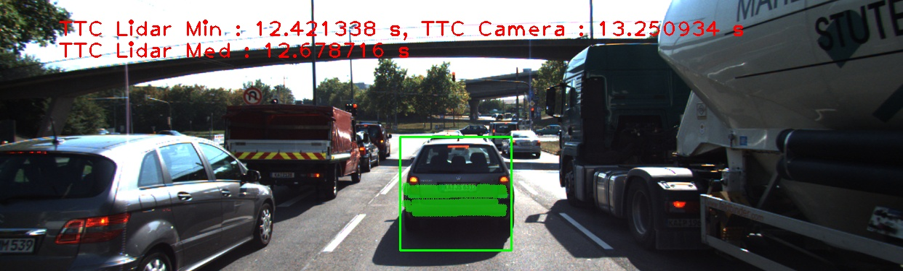|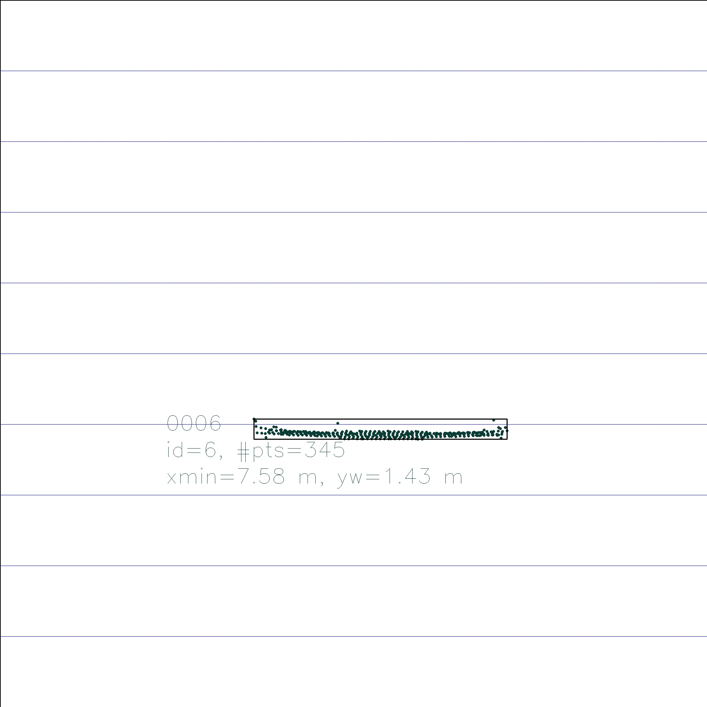|
||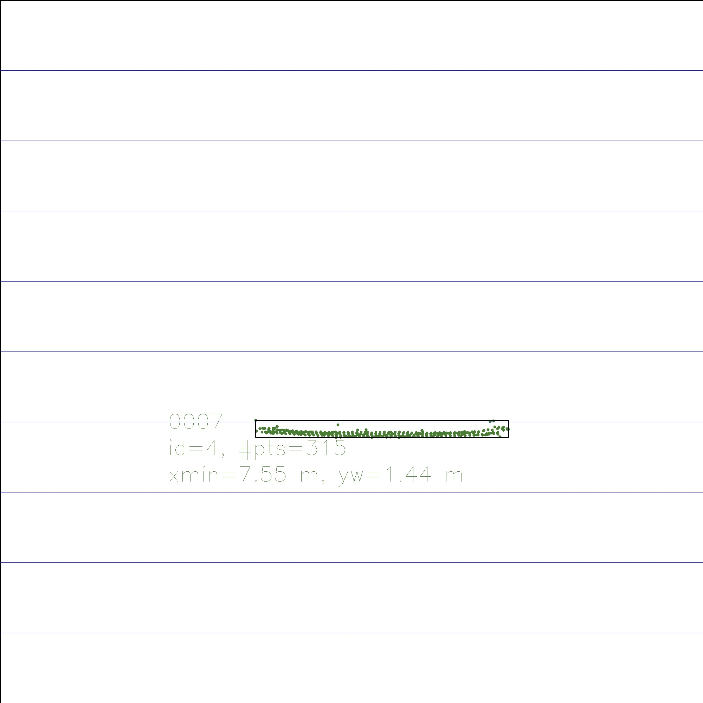|


In image 12 we see a negative number for the ttc as computed by the x min value of the lidar points. Again by using the median value to calculate the time to collision we get a more realistic value of approx 9s. By inspecting the points mapped onto the bounding box we can see a difference in the points being mapped between image frame 11 and 12 with image 11 registering lidar points lower on the front car.

|TTC  |TopView  |
|---------|---------|
|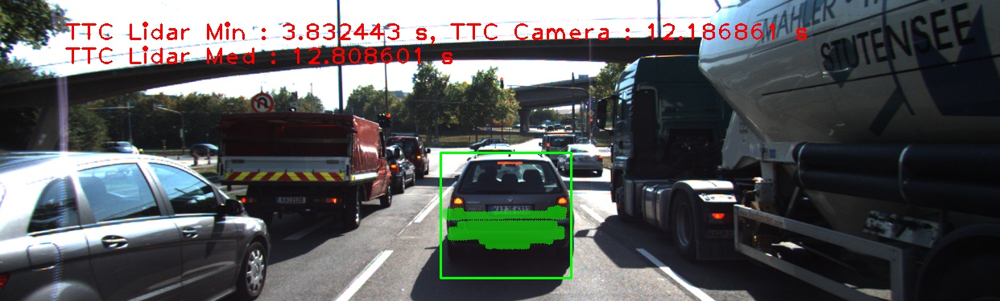|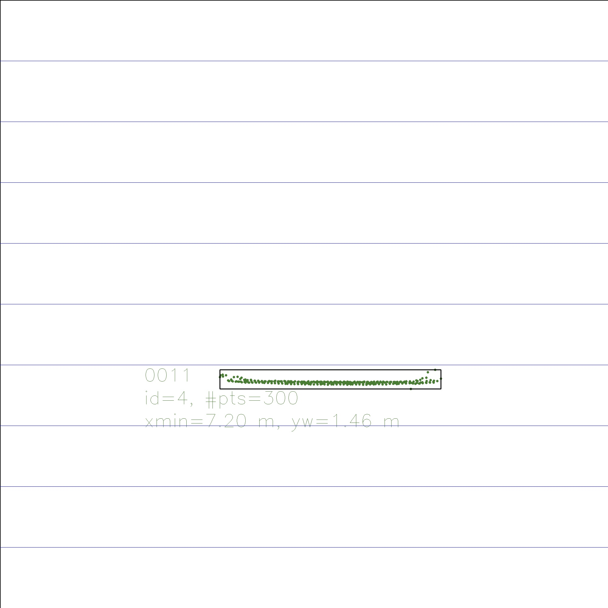|
|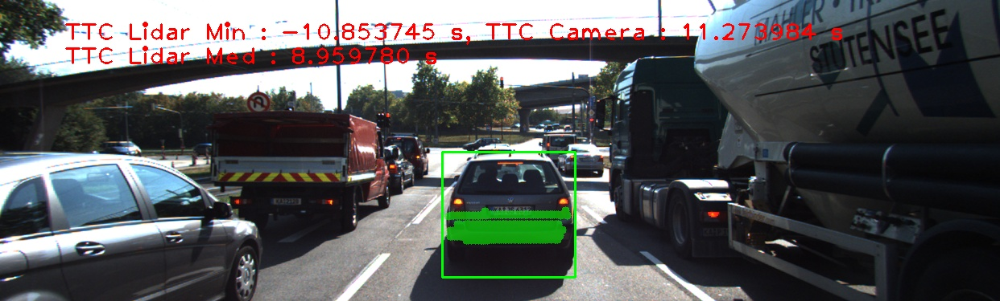|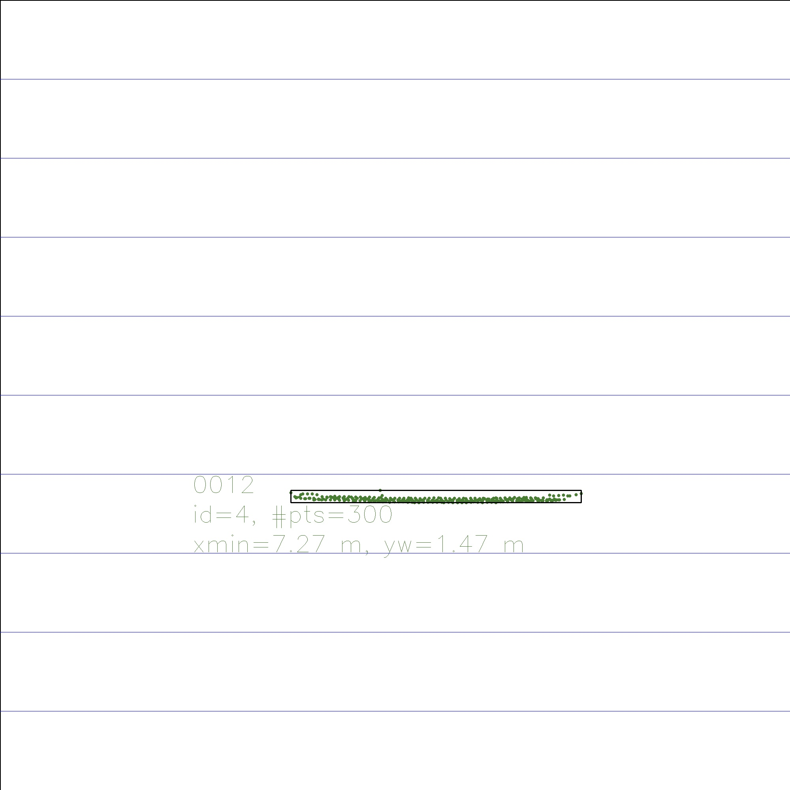|


Results below present the difference between using the minimum value of x and using a median of the x values of the lidar points. Although it will not give the minimum value of ttc it shows a more consistent calculation as the standard deviation of times is lower in the case of using the median value and therefor removes the infuence of outliers on the calculation.

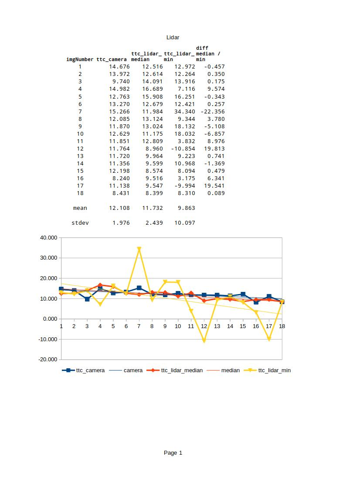


**FP.6 Performance Evaluation 2**

*Run several detector / descriptor combinations and look at the differences in TTC estimation. Find out which methods perform best and also include several examples where camera-based TTC estimation is way off. As with Lidar, describe your observations again and also look into potential reasons.*

From the results we can see that using the vaious combinations of descriptor/detector gave similar results with the average ttc based on camera keypoints was around 12-13 seconds with the notable exception of ORB / ORB and ORB / BRIEF having a lot higher averages. 

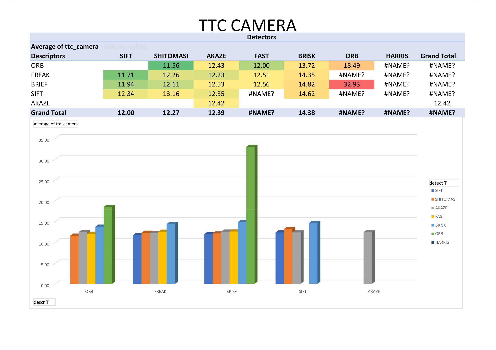

We can see from the following examples that the keypoints on another car in the front left are also being matched.

ORB/BRIEF
|Keypoints  |
|---------|
||
|TTC  |
|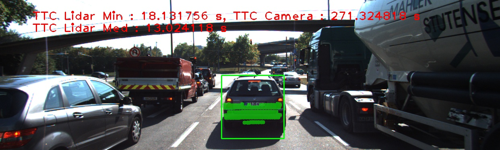|

ORB/ORB
|Keypoints  |
|---------|
|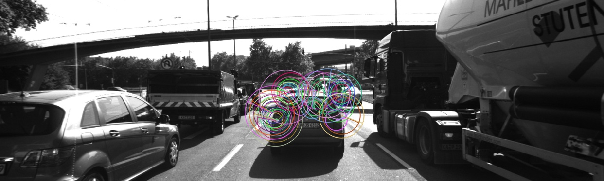|
|TTC  |
|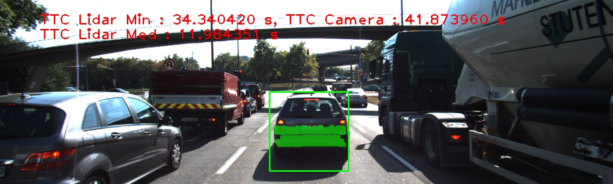|

|Keypoints  |
|---------|
||
|TTC  |
||

By examing the total amount of time for for detection, descripion and matching we can also see that detectors such as FAST using various descriptors (BRIEF, SIFT, FREAK) are able to perfom below the 100ms (required to achieve 10 frames per second) mark.

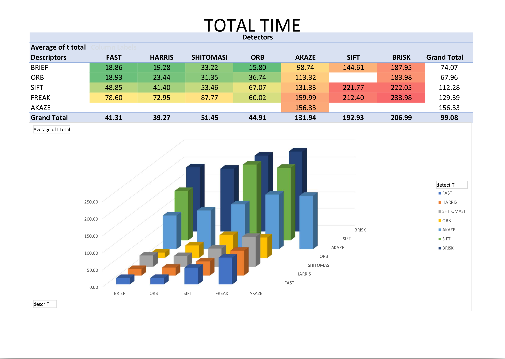


# SFND 3D Object Tracking

Welcome to the final project of the camera course. By completing all the lessons, you now have a solid understanding of keypoint detectors, descriptors, and methods to match them between successive images. Also, you know how to detect objects in an image using the YOLO deep-learning framework. And finally, you know how to associate regions in a camera image with Lidar points in 3D space. Let's take a look at our program schematic to see what we already have accomplished and what's still missing.


In this final project, you will implement the missing parts in the schematic. To do this, you will complete four major tasks: 
1. First, you will develop a way to match 3D objects over time by using keypoint correspondences. 
2. Second, you will compute the TTC based on Lidar measurements. 
3. You will then proceed to do the same using the camera, which requires to first associate keypoint matches to regions of interest and then to compute the TTC based on those matches. 
4. And lastly, you will conduct various tests with the framework. Your goal is to identify the most suitable detector/descriptor combination for TTC estimation and also to search for problems that can lead to faulty measurements by the camera or Lidar sensor. In the last course of this Nanodegree, you will learn about the Kalman filter, which is a great way to combine the two independent TTC measurements into an improved version which is much more reliable than a single sensor alone can be. But before we think about such things, let us focus on your final project in the camera course. 

## Dependencies for Running Locally
* cmake >= 2.8
  * All OSes: [click here for installation instructions](https://cmake.org/install/)
* make >= 4.1 (Linux, Mac), 3.81 (Windows)
  * Linux: make is installed by default on most Linux distros
  * Mac: [install Xcode command line tools to get make](https://developer.apple.com/xcode/features/)
  * Windows: [Click here for installation instructions](http://gnuwin32.sourceforge.net/packages/make.htm)
* Git LFS
  * Weight files are handled using [LFS](https://git-lfs.github.com/)
* OpenCV >= 4.1
  * This must be compiled from source using the `-D OPENCV_ENABLE_NONFREE=ON` cmake flag for testing the SIFT and SURF detectors.
  * The OpenCV 4.1.0 source code can be found [here](https://github.com/opencv/opencv/tree/4.1.0)
* gcc/g++ >= 5.4
  * Linux: gcc / g++ is installed by default on most Linux distros
  * Mac: same deal as make - [install Xcode command line tools](https://developer.apple.com/xcode/features/)
  * Windows: recommend using [MinGW](http://www.mingw.org/)

## Basic Build Instructions

1. Clone this repo.
2. Make a build directory in the top level project directory: `mkdir build && cd build`
3. Compile: `cmake .. && make`
4. Run it: `./3D_object_tracking`.
